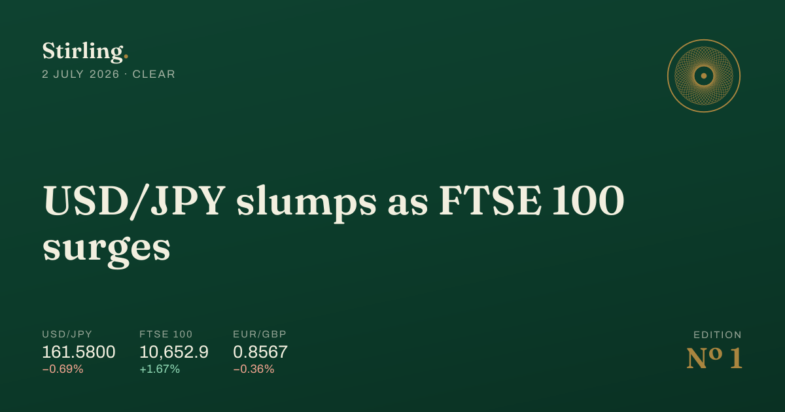
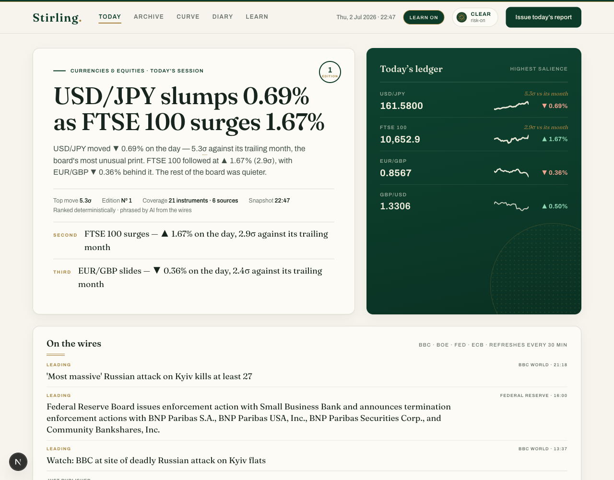
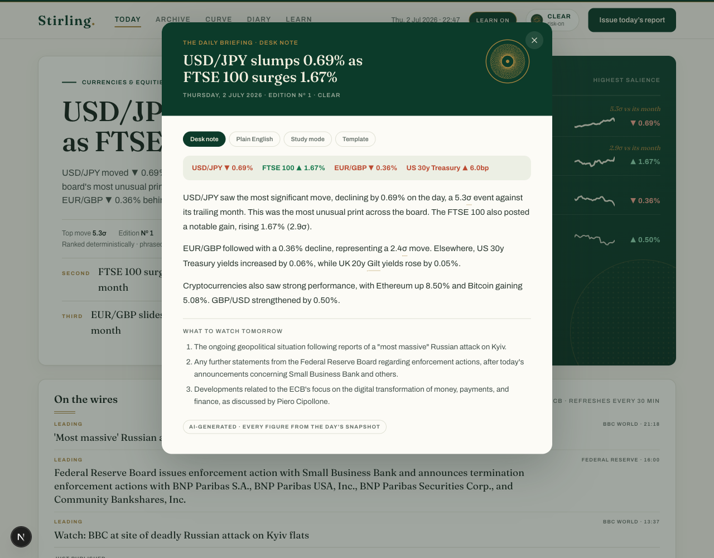
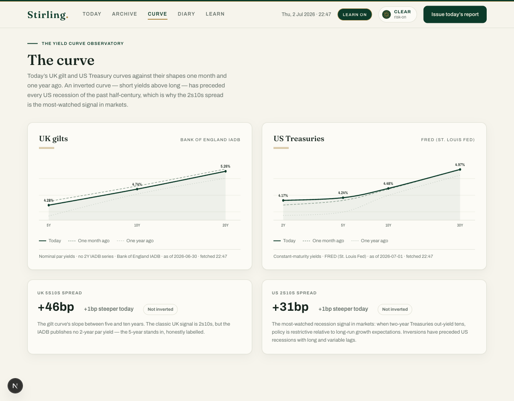
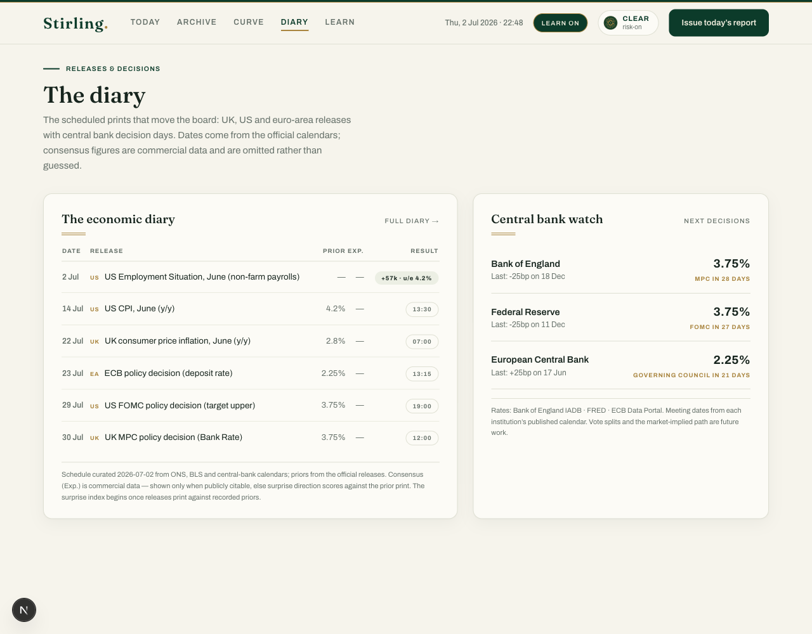
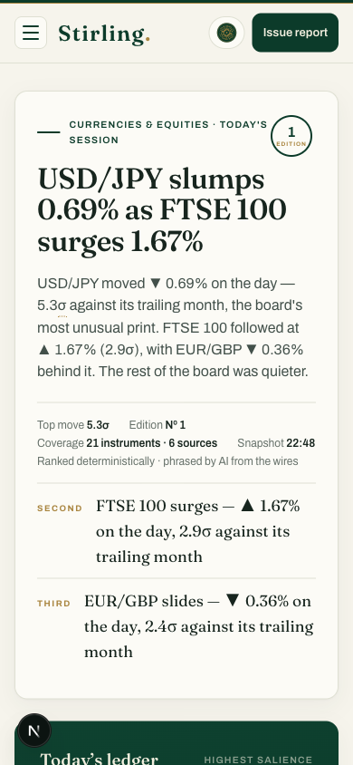

<div align="center">



# Stirling.

**The daily economic intelligence terminal — one immutable edition a day, at £0/month.**

**[→ Read today's edition at stirling-report.vercel.app](https://stirling-report.vercel.app/)**

*Named after Stirling Moss — a homophone of sterling. Racing green, brass detail, and one story a day.*

</div>

---

## Who built this

Hi — I'm **Padraig**, a university student heading into my second year studying **Economics and Finance**.

Stirling exists because of a problem I kept running into: staying genuinely fluent in markets is hard when you're a student. Bloomberg terminals cost more than my rent, free finance sites are a wall of tickers with no narrative, and reading the FT tells you what happened but not *how unusual it was*. I wanted something that would tell me, in thirty seconds every morning, **what actually mattered yesterday and why** — the way a sell-side morning note does for people who work on a desk.

So I built one. Stirling is a tool I actually use every day: it reads the markets for me overnight, decides what mattered using auditable maths rather than vibes, writes it up like a morning note, and files every day away in a permanent archive. By the time internship interviews come around, "talk me through markets today" is a home fixture — I read my own product at breakfast, and the archive means I can revise the last month's narrative arc the night before. It keeps me informed, it teaches me the vocabulary of the industry I want to work in, and it costs me nothing to run.

It's also, deliberately, a portfolio piece: a deployed, automated production system with a designed identity — not a notebook.

---

## What it is

Every evening at **22:05 UK time**, Stirling ingests daily market and macro data from free public APIs, ranks what mattered, and issues one **immutable, numbered edition** — same numbers, same story, same AI-written briefing, forever. During the day it runs as a live edition refreshing every 30 minutes.



### The front page

- **Story of the Day** — a deterministic engine ranks every instrument's move by *salience* (size in standard deviations × how systemically important the asset class is) and templates the headline. The AI may phrase it against the news wires, but **code decides what mattered, never the model**.
- **Today's Ledger** — the four most unusual moves on the board, set in cream on racing green. Sparkline stroke weight scales with how abnormal the move is: routine days print light, violent days print heavy.
- **On the wires** — headlines from official feeds (BBC, Bank of England, Fed, ECB), linked out. Every story above an auditable salience threshold *leads*, so a war headline from breakfast can't be buried by afternoon trivia.
- **The market board** — FX, indices, commodities, crypto and rates, each with level, day change, z-score-aware styling and a scrubbable 30-day sparkline. **Star any tile** to build your watchlist (stored in your browser — no accounts, ever).

### The daily report

One press of **Issue today's report** opens the day's briefing — written once by AI at snapshot time and cached for every reader, in three tones: **Desk note** (professional), **Plain English** (no jargon), and **Study mode** (each paragraph ends with the concept a student should look up). If AI quota ever fails, a deterministic template briefing takes over — the product never shows a blank.



Every briefing obeys hard rules: it may only cite numbers present in the day's snapshot, it must hedge causality ("consistent with…"), it must end with *What to watch tomorrow*, and it may only reference news events that actually appeared on the wires — with a plausibility gate so it never forces a causal link that isn't there.

### The Yield Curve Observatory

UK gilt and US Treasury curves against their shapes one month and one year ago, with spread trackers that flag inversion — the most-watched recession signal in markets — and count consecutive inverted sessions. Hover anywhere to scrub exact yields.



### The diary & central bank watch

The scheduled releases that move markets — UK, US and euro area — with priors from the official releases and BEAT/MISS scoring, beside live policy rates for the Bank of England, Fed and ECB with real decision countdowns from their published calendars.



### The archive — the Time Machine

Every edition is immutable and permanently replayable: click any date and the entire dashboard reconstructs exactly as it stood that evening, under a green *Replay* banner so past is never mistaken for present. **Play Week** animates through five sessions to watch a narrative arc unfold. The archive is also an open dataset (`/api/editions/index`) mirrored nightly into this repo's [`/data`](data/editions) folder.

This is the moat: the product improves autonomously every single day it's deployed, because the archive only grows.

### Learn mode & interview prep

Flip one toggle and every technical term across the site grows a dotted brass underline — click for a two-sentence definition and why it matters today. Terms you open build a personal glossary in your browser. The Learn page adds **Interview Prep Mode**: a model "talk me through markets today" answer where *every sentence carries a footnote naming the exact data point it derives from*, flashcards drilled from the archive, and a printable Last-30-Days one-pager.

### And it all works on a phone



---

## How it works

```
07:00–21:30  Live edition — tiles refresh via ISR every 30 minutes
22:05        Snapshot cron: fetch all sources → compute z-scores, salience,
             weather → freeze the wires → ≤3 Gemini calls (one per tone)
             → write the immutable numbered edition JSON to Vercel Blob
22:20        GitHub Action mirrors the edition into /data — an open dataset
```

The architecture is **snapshot-first**: page requests never fan out to external APIs. One JSON snapshot per day drives everything, pages read it (plus a light 30-minute intraday cache), and past editions are never rewritten — immutability is enforced in the storage layer, not by convention.

The editorial trust model runs the same way throughout:

| Judgement | Made by |
|---|---|
| What mattered today (the ranking) | Deterministic code — `\|z\| × class weight`, auditable |
| The weather gauge (Clear → Storm) | Deterministic composite of intensity × breadth |
| Which wire headline leads | Deterministic score — keyword tier × source × recency half-life |
| How it's *worded* | AI, once per day, from the snapshot only |
| When AI is unavailable | A template briefing built from the same numbers |

Every panel degrades honestly: a failed source shows *"stale since…"* with the reason — never a crash, never a silently wrong number, never an invented figure.

## The data — everything free, everything cited

| Domain | Source | Key needed |
|---|---|---|
| FX (GBP/USD, EUR/USD, USD/JPY, EUR/GBP) | [Frankfurter](https://frankfurter.dev) (ECB reference rates) | No |
| Indices & commodities | Yahoo Finance chart API *(Stooq fallback path — see NOTES.md)* | No |
| Crypto (BTC, ETH) | CoinGecko | No |
| UK Bank Rate & gilt yields | Bank of England IADB | No |
| US Treasuries & Fed target | FRED (St. Louis Fed) | Free key |
| Euro-area policy rate | ECB Data Portal | No |
| News wires | BBC / BoE / Fed / ECB official RSS — headlines only, linked out | No |
| AI briefings | Google Gemini Flash — 3 calls/day, cached | Free key |

Every provider has a recorded-fixture unit test (no live calls in tests), a health state, and a named fallback. API quirks discovered while building are documented in [`NOTES.md`](NOTES.md).

**Total running cost: £0.00/month** — Vercel Hobby, free data tiers, and a generate-once-read-many AI pattern that uses under 1% of the free quota.

## The design — "Racing Ink"

A light, warm identity built from British racing green, ivory paper and brass detail — coachlines, a door-number roundel for the edition, and a generative **guilloché medallion** whose engraving is redrawn daily from the data (volatility sets the petal count; storm days weave in a vermilion thread). Exactly one saturated green surface per view. Gains print emerald, losses vermilion, always with ▲/▼ glyphs. No dark mode, no monospace — tabular figures do the terminal's job without the hacker costume.

The full specification lives in [`WHITEPAPER.md`](WHITEPAPER.md).

## Running it yourself

```bash
git clone https://github.com/poggey/stirling-report.git
cd stirling-report
npm install
cp .env.example .env.local   # add FRED_API_KEY and GEMINI_API_KEY (both free) — optional
npm run dev                  # the site runs keyless too, with honestly-labelled fallbacks
npm test                     # 46 tests, fixture-backed, no live calls
```

Issue an edition locally with `curl localhost:3000/api/cron/snapshot`. In production, Vercel Cron runs it nightly; set `CRON_SECRET`, add a Blob store, and set the `SITE_URL` repo variable so the mirror action runs.

---

<div align="center">

**[stirling-report.vercel.app](https://stirling-report.vercel.app/)**

*Informational only — not investment advice.*
*Sources: Frankfurter (ECB) · CoinGecko · Yahoo Finance · Bank of England · FRED · ECB · BBC News*

</div>
